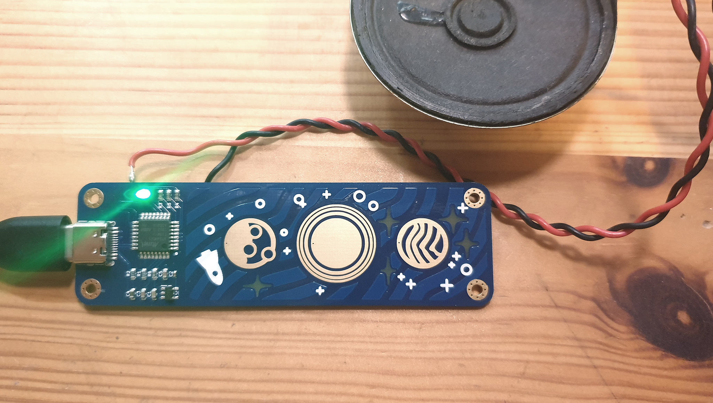
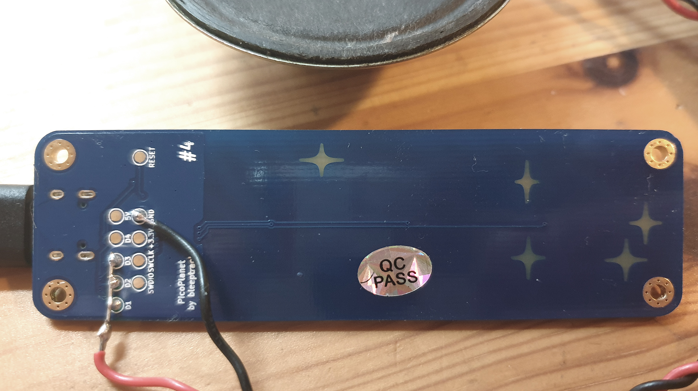

# picoplanet_polysynth

My second experiment with the nice PicoPlanets (https://github.com/bleeptrack/picoplanet): a simple polyphonic synthesizer, using pwm. Raw touch button values go directly into the frequency. Wiring is quiete simple, using an 8 ohm speaker. 

